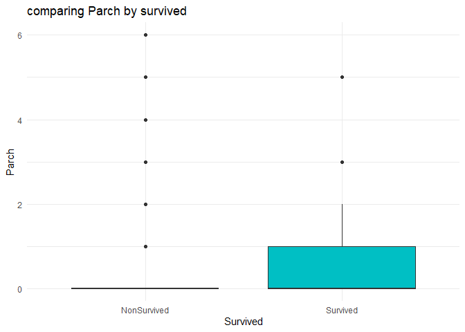

# Introduction

The Titanic disaster is one of the most well-known maritime tragedies in
history. In 1912, the Titanic, a British passenger liner, sank in the
North Atlantic Ocean after colliding with an iceberg. The disaster
resulted in the loss of more than 1,500 lives. The Titanic disaster
continues to fascinate people, and there have been numerous books,
films, and documentaries produced about it.

This dataset contains cleaned data on the passengers who were aboard the
Titanic when it sank. The data includes information on the passengers’
age, gender, ticket class, cabin class, and whether they survived the
disaster. The purpose of this visualization report is to explore and
analyze this dataset to gain insights into the factors that influenced
the survival rate of the passengers. By analyzing the data, we hope to
gain a better understanding of the Titanic disaster and its impact on
the passengers who were aboard the ship.

# Data summary

The Titanic cleaned data set contains information on 891 of the 2224
passengers and crew members who were on board the Titanic. The data has
been cleaned and preprocessed for analysis. It includes information on
various attributes such as passenger age, gender, ticket class, cabin
class, and whether the passenger survived the disaster or not.

``` r
library(tidyverse)
library(psych)
library(randomForest)

theme_set(theme_minimal())

df = read_csv("data/train_clean.csv")

df %>% mutate(Survived = ifelse(Survived ==1, 'Survived', 
                                       'NonSurvived')) ->df
```

-   PassengerId: Unique identifier for each passenger
-   Survived: Whether the passenger survived or not (0 = No, 1 = Yes)
-   Pclass: Ticket class (1 = 1st, 2 = 2nd, 3 = 3rd)
-   Name: Passenger’s name
-   Sex: Passenger’s sex
-   Age: Passenger’s age in years
-   SibSp: Number of siblings/spouses aboard the Titanic
-   Parch: Number of parents/children aboard the Titanic
-   Ticket: Ticket number
-   Fare: Passenger fare
-   Cabin: Cabin number
-   Embarked: Port of embarkation (C = Cherbourg, Q = Queenstown, S =
    Southampton)

The characteristics of the dataset affect the analysis methodology.

-   the variables which are neatural for surviving will be dropped, that
    is, `Cabin`, `PassengerId`, `Ticket` and `Name`.

-   Luckily, there is no missing value after dropping these columns.

-   Moreover, there are both categorical and numerical variables, we
    will take analysis on them seperately.

To summarize the dataset, we can begin by examining the basic statistics
of the numerical variables (such as age, fare, etc.) using measures such
as mean, median, standard deviation, and quartiles.

``` r
library(pander)
num_df = df %>% select(
  Age, Fare, Parch, SibSp,  Family_Size
)

cat_df = df %>%
  select(-c(Age, Fare, Parch, SibSp,  Family_Size)) %>%
  select(-c(Cabin, Name, PassengerId,Ticket))


for(col in colnames(cat_df)){
  cat_df[,col] = factor(cat_df %>% pull(col))
}


uni_cat = function(col){
  
  cat_df %>%
    group_by(!!sym(col)) %>%
    count() %>%
    ungroup() %>%
    mutate(proportion = n /sum(n) )-> ct
  
  ct %>%
    ggplot(aes(!!sym(col), proportion, fill = !!sym(col))) +
    geom_col() +
    geom_text(aes(label = n),vjust = -0.5) +
    theme(legend.position = "none") + 
    labs(title = "col distribution" %>%
           gsub('col', col, .)) ->fig
  
  return(fig)
}


num_df %>% pivot_longer(cols = num_df %>%
                          colnames()) %>%
  group_by(name) %>%
  summarise(n_levels = length(unique(value))) -> values_ct


values_ct %>% filter(n_levels <10) %>%
  pull(name) -> may_cat


num_df %>%
  describe() %>%
  select( mean:median, min:kurtosis) %>%
  pander()
```

|                 |  mean  |   sd   | median | min  |  max  | range |  skew  | kurtosis |
|:---------------:|:------:|:------:|:------:|:----:|:-----:|:-----:|:------:|:--------:|
|     **Age**     | 29.45  | 13.24  |   30   | 0.42 |  80   | 79.58 | 0.4314 |  0.7686  |
|    **Fare**     |  32.2  | 49.69  | 14.45  |  0   | 512.3 | 512.3 | 4.771  |  33.12   |
|    **Parch**    | 0.3816 | 0.8061 |   0    |  0   |   6   |   6   |  2.74  |  9.688   |
|    **SibSp**    | 0.523  | 1.103  |   0    |  0   |   8   |   8   | 3.683  |  17.73   |
| **Family_Size** | 0.9046 | 1.613  |   0    |  0   |  10   |  10   | 2.718  |  9.074   |

Following histogram plots provide the visualization for these fact, the
distribution of age seems being symmetric, however, all other variables’
distributions are quite right skewed.

``` r
num_df %>% pivot_longer(cols = num_df %>%
                          colnames()) %>%
  ggplot(aes(y = value, fill = name)) +
  geom_histogram() +
  facet_grid(vars(name), scales = 'free') +
  theme(legend.position = "none") +
  labs(title = "Distribution of numerical features")
```


We can then create frequency tables to examine the distribution of
categorical variables , however, this could be better demonstrated using
bar chart, the y axis represent the proportion, while the number above
the bar is the absolute number in each level, the data is not even
distributed, regardless we use which categorical variable to classify
the data.

``` r
uni_cat('Pclass')
```


``` r
uni_cat('Embarked')
```


``` r
uni_cat('Sex')
```


``` r
uni_cat('Survived')
```


``` r
uni_cat('Title')
```


# Data analytics

## Bivariate analysis

Bivariate analysis is a statistical analysis method used to explore the
relationship between two variables. In this case, we will use bivariate
analysis to explore the relationship between various features and the
outcome variable, “Survived”.

For numerical features, we compare the distributions by varying the
survived status, the result are expressed by side by side boxplot:

``` r
bi_num = function(col){
  
  stat = df %>%
    group_by(Survived) %>%
    summarise(describe(!!sym(col)))  %>%
    select(Survived, mean, median, sd, skew, kurtosis)
  
  df %>%
    ggplot(aes(x = Survived, y = !!sym(col) , fill = Survived)) +
    geom_boxplot()+
    theme(legend.position = "none") +
    labs(title = "comparing col by survived" %>%
           gsub("col", col, .)) ->f
  
  print(f)
  
  return(list(s = stat, f = f))
  
  
}

tmp = bi_num('Age')
```


``` r
tmp$s %>% pander()
```

|  Survived   | mean  | median |  sd   |  skew  | kurtosis |
|:-----------:|:-----:|:------:|:-----:|:------:|:--------:|
| NonSurvived | 30.25 |   30   | 12.66 | 0.6834 |  1.106   |
|  Survived   | 28.15 |   28   | 14.06 | 0.1916 |  0.2139  |

Based on the statistics and visualization, people in NonSurvived group
is elder.

``` r
tmp = bi_num('Fare')
```


``` r
tmp$s %>% pander()
```

|  Survived   | mean  | median |  sd   | skew  | kurtosis |
|:-----------:|:-----:|:------:|:-----:|:-----:|:--------:|
| NonSurvived | 22.12 |  10.5  | 31.39 | 4.528 |  26.01   |
|  Survived   | 48.4  |   26   | 66.6  | 3.829 |  20.21   |

Based on the statistics and visualization, fare in NonSurvived group is
higher.

``` r
tmp = bi_num('Parch')
```



``` r
tmp$s %>% pander()
```

|  Survived   |  mean  | median |   sd   | skew  | kurtosis |
|:-----------:|:------:|:------:|:------:|:-----:|:--------:|
| NonSurvived | 0.3297 |   0    | 0.8232 | 3.305 |  13.23   |
|  Survived   | 0.4649 |   0    | 0.7717 | 1.739 |  3.474   |

Based on the statistics and visualization, It is unclear the
relationship between Survived and Parch.

``` r
tmp = bi_num('SibSp')
```


``` r
tmp$s %>% pander()
```

|  Survived   |  mean  | median |   sd   | skew  | kurtosis |
|:-----------:|:------:|:------:|:------:|:-----:|:--------:|
| NonSurvived | 0.5537 |   0    | 1.288  | 3.497 |  14.27   |
|  Survived   | 0.4737 |   0    | 0.7087 | 1.941 |  5.306   |

Based on the statistics and visualization, It is unclear the
relationship between Survived and SibSp.

``` r
tmp = bi_num('Family_Size')
```


``` r
tmp$s %>% pander()
```

|  Survived   |  mean  | median |  sd   | skew  | kurtosis |
|:-----------:|:------:|:------:|:-----:|:-----:|:--------:|
| NonSurvived | 0.8834 |   0    | 1.831 | 2.766 |  8.235   |
|  Survived   | 0.9386 |   1    | 1.186 | 1.622 |  3.332   |

Based on the statistics and visualization, family size in NonSurvived
group is larger.

For categorical features, we compare the distributions by varying the
survived status, the result are expressed by side by side bar chart:

``` r
bi_cat = function(col){
  df %>% group_by(
    Survived, !!sym(col)
  ) %>%
    summarise(n = n()) %>%
    mutate(proportion = (n /sum(n)) %>%
             round(3)) ->ct
  
  ct %>%
    ggplot(aes(Survived, proportion, fill = !!sym(col) %>%
                 as.factor())) +
    geom_col(position = "dodge") +
    labs(title = "comparing col by survived" %>%
           gsub("col", col, .), fill = col) ->f
  
  return(list(s = ct, f = f))
  
}


bi_cat('Pclass')$f
```


The proportion of class 3 in NonSurvived group is quite higher.

``` r
bi_cat('Embarked')$f
```


The proportion of Embarked port C in Survived group is quite higher. The
proportion of Embarked port S in NonSurvived group is quite higher.

``` r
bi_cat('Sex')$f
```


The proportion of males in NonSurvived group is quite higher.

``` r
bi_cat('Title')$f
```


The proportion of people with Title `Mrs` in Survived group is quite
higher, as well as the propotion of people with title `Master`.

We also examine the association between some numerical encoded variables
and the outcome variable in the way we convert them into categorical
variables. More or less, this convertion may be reasonable, for example,
it is unclear the relationship between Survived and SibSp, however, in
case we treat SibSp as categorical, the proportion single SibSp in
Survived group is quite higher.

``` r
bi_cat('Parch')$f
```


``` r
bi_cat('SibSp')$f
```


``` r
bi_cat('Family_Size')$f
```


## Multviarte analysis

We use logistic regression and random forest classifier to determine the
most impact factor on Survived.

### logistic regression

In logistic regression, we use all possible predictors in a full model,
then we remove the predictors step wise based on AIC. Following table
gives the estimation:

``` r
mdf = cbind(num_df, cat_df)

mdf$Survived = as.factor(mdf$Survived)

glm(Survived ~ ., data = mdf, family = binomial()) -> lgr

step(lgr, trace = F) -> back

back %>% summary() %>%
  coef()-> backs

backs %>%
  pander()
```

|                 | Estimate | Std. Error | z value  | Pr(\>\|z\|) |
|:---------------:|:--------:|:----------:|:--------:|:-----------:|
| **(Intercept)** |  1.383   |   0.9272   |  1.492   |   0.1357    |
|     **Age**     | -0.02868 |  0.00945   |  -3.035  |  0.002405   |
|    **Fare**     | 0.004045 |  0.002598  |  1.557   |   0.1195    |
|    **Parch**    | -0.3619  |   0.1331   |  -2.719  |  0.006539   |
|    **SibSp**    | -0.5824  |   0.125    |  -4.66   |  3.164e-06  |
|   **Pclass2**   |  -1.147  |   0.3193   |  -3.592  |  0.0003279  |
|   **Pclass3**   |  -2.178  |   0.3093   |  -7.041  |  1.903e-12  |
| **TitleMaster** |  2.684   |   0.971    |  2.764   |  0.005716   |
|  **TitleMiss**  |  2.175   |   0.8438   |  2.578   |   0.00995   |
|   **TitleMr**   | -0.7853  |   0.8121   | -0.9671  |   0.3335    |
|  **TitleMrs**   |  2.988   |   0.8557   |  3.492   |  0.0004794  |
|  **TitleRev**   |  -14.53  |   585.5    | -0.02483 |   0.9802    |

Using the absolute z value as measure for impact level, following figure
visualize the impact level and direction:

``` r
backs %>%
  as.data.frame() %>%
  mutate(Features = rownames(backs),
         abs = abs(`z value`))  %>%
  filter(`Pr(>|z|)` < 0.05) %>%
  ggplot(aes(`z value` ,Features %>%
               reorder(abs), fill = `z value`)) +
  geom_col() +theme(legend.position = "none" )+
  labs(title = "Impact of Features (Logistic Regression)",  y = 'Features')
```


### Random Forest

Also, we use random forest model to determine the rank of importance of
predictors:

``` r
randomForest(Survived ~ ., data = mdf) -> rf
importance(rf) %>% as.data.frame() %>%
  arrange(-MeanDecreaseGini) ->rf_imp
rf_imp$Variable = rownames(rf_imp)
rf_imp %>% ggplot(aes(Variable %>%reorder(-MeanDecreaseGini), 
                      MeanDecreaseGini, fill = -MeanDecreaseGini)) +
  geom_col() +
  theme(legend.position = "none" )+
  labs(title = "Importance of Features (Random Forest)",  x = 'Features')
```


# Conclusion

The backward elimination approach using logistic regression and random
forest models helps us identify the most important features that predict
survival on the Titanic.

According to the logistic regression model, the features that most
significantly reduce the probability of survival are being in the 3rd
class cabin, having a large number of siblings/spouses aboard (SibSp),
and being in the 2nd class cabin. In addition, increasing age is
associated with a lower probability of survival. On the other hand,
having the title of Mrs., followed by the titles of Master and Miss, is
associated with higher probabilities of survival.

According to the random forest model, the top three most important
features in predicting survival are Title, Fare, and Gender. This
implies that the passenger’s title, their fare, and their gender are
highly indicative of whether they are likely to survive or not.

Overall, the results of the logistic regression and random forest models
suggest that certain passenger attributes, such as cabin class, age,
title, fare, and gender, have a significant impact on the likelihood of
survival. This information can be useful in developing a predictive
model to estimate the likelihood of survival of passengers on the
Titanic. It can also help us better understand the factors that
influenced the survival outcomes of passengers during the disaster.

# DevOps

Using GitHub for a solo project provides several benefits, including the
ability to track changes and maintain a backup of your code, build a
portfolio, and collaborate with others if desired. However, there is a
learning curve involved in using GitHub effectively, and it requires
ongoing maintenance to keep your code up-to-date on the platform.
Additionally, if you have sensitive information in your project, such as
passwords or personal data, it may not be safe to store it on a public
platform like GitHub.

For group projects, GitHub provides several advantages, such as enabling
efficient and effective collaboration, allowing multiple users to work
on the same project simultaneously, tracking changes and resolving
conflicts, and helping to keep the project organized and on track.
GitHub also allows you to control who has access to the project, which
can be important if you need to keep sensitive information secure.
However, as with solo projects, there is a learning curve involved, and
merge conflicts can occur when multiple people are working on the same
code. Additionally, it’s important to establish guidelines around code
ownership and use, which can be more complex in a group setting.
Finally, GitHub can experience technical issues from time to time, which
can impact productivity. Overall, the benefits of using GitHub for both
solo and group projects generally outweigh the drawbacks, but it’s
important to carefully consider the potential challenges before deciding
to use the platform.
